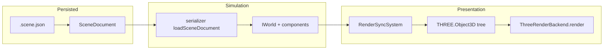
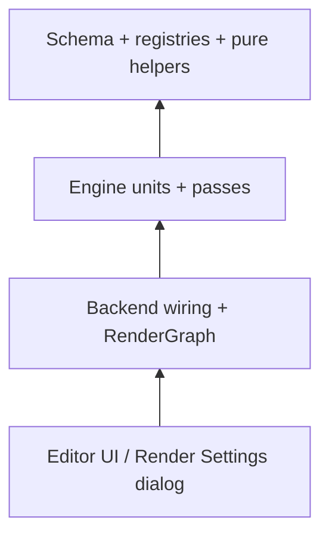

# RENDER_PLAN — Haku Rendering Architecture & Roadmap

> **Audience:** Implementation agent.  
> **Status:** Planning document only — no implementation implied by this file.  
> **Goal:** Canonical, scalable rendering stack for `@haku/engine` + `@haku/editor`, aligned with Three.js best practices (WebGL today, WebGPU/TSL later).

---

## 1. Executive summary

Haku already separates **simulation** (`IWorld`, components, systems) from **presentation** (`RenderSyncSystem`, `ThreeRenderBackend`). Rendering today is a **single forward pass** + **one editor-only overlay** (selection outline). Materials support one type (`standard` → `MeshStandardMaterial`) via a schema registry.

This plan defines:

1. Extension of the **material type registry** to cover remaining built-in Three.js mesh materials used in production games.
2. A **Render Settings** window (menu-driven) for scene/viewport configuration, with per-capability **feature flags**.
3. **Shadow mapping** (built-in Three.js shadow subsystem).
4. A **post-processing pipeline** abstraction (extensible passes).
5. **Render target** workflow (offscreen cameras, textures).
6. **Layer masks** for visibility filtering across passes.

Architecture centers on a **`RenderGraph`** owned by the engine, configured by **schema-backed scene data** and **editor UI**, without leaking React or editor gizmos into `@haku/engine`.

**Agent rules (mandatory):** implement in **small, testable increments** — shared primitives first (schema, registries, pure helpers), then engine units, then wiring, then editor UI. Every increment ships with **unit tests** and is gated by **`RenderSettings.features`** so it can be toggled off in Render Settings without removing code.

**Related docs:** `IMPLEMENTATION_PLAN.md` (phases, ECS, render buckets), `AGENTS.md` (package layout, commands).

---

## 2. Haku architecture context (for agents)

This section grounds the rendering roadmap in the **actual codebase**. Read it before implementing any phase.

### 2.1 Monorepo layout & dependency rules

```
apps/
  playground/     @haku/playground — minimal runtime shell (engine only, no React)
  editor/         @haku/editor-app — Vite shell that mounts @haku/editor

packages/
  schema/         @haku/schema     — Zod scene document v1, material registry (no Three.js)
  core/           @haku/core       — IWorld, components, ISystem, IRenderBackend (no Three.js)
  serializer/     @haku/serializer — SceneDocument ↔ World hydration
  engine/         @haku/engine     — Three.js, Engine, RenderSyncSystem, mesh-factory
  editor/         @haku/editor     — React UI, store, viewport, inspector
  create/         @haku/create     — external game scaffolder
```

**Hard rule (from `AGENTS.md`):** `engine` and `playground` **never** depend on `editor` or React. The editor viewport uses the **same** `Engine` + `ThreeRenderBackend` path as the playground.

### 2.2 Simulation ≠ Presentation

| Layer | Responsibility | Key types |
| ----- | -------------- | --------- |
| **Simulation** | Entity graph, component data, game logic systems | `IWorld`, `TransformComponent`, `MeshRendererComponent`, `LightComponent`, `CameraComponent` |
| **Presentation** | Mirror simulation state to GPU objects and draw | `RenderSyncSystem`, `ThreeRenderBackend`, `mesh-factory.ts` |

Component data lives in `IWorld` and is **serializable** via `SceneDocument` (`.scene.json`). Three.js `Object3D` / `Material` instances are **derived** each frame (or on change) by `RenderSyncSystem` — they are not the source of truth.

**Render buckets** (from `IMPLEMENTATION_PLAN.md`): entities reference `RenderPrototype` (`mode: mesh | instanced | batched | sprite-atlas`). Today only primitive `mesh` mode is fully wired; `setPrototypes()` on the backend is a stub. Future instancing should extend `RenderSyncSystem`, not bypass it.

### 2.3 Scene document → runtime world

`SceneDocument` (`packages/schema/src/index.ts`):

```ts
{
  schemaVersion: 1,
  metadata: { name },
  entities: EntityRecord[],      // id, name, parent, components[]
  prototypes: Record<string, RenderPrototype>,
  prefabs: Record<string, PrefabDefinition>,
}
```



**Load path (playground):**

```
haku.project.json → SceneLoader.load(url)
  → validateSceneDocument (Zod)
  → loadSceneDocument (serializer) → IWorld
  → engine.loadWorld(world, prototypes, prefabs)
  → backend.attach(world) → RenderSyncSystem.syncAll()
```

**Load path (editor):** project service opens scene → `editor-store` holds `world` + `sceneDocument` → `ViewportPanel` calls `engine.loadWorld(...)` when either changes.

**Edit path (editor):** inspector / asset browser / gizmo → `commitSceneEdit(draft => …)` → clones `world` + `sceneDocument` → increments `worldRevision` → React effects push new world into engine via `engine.setWorld(world)`.

Undo/redo: `SceneEditCommand` snapshots `{ world, sceneDocument, selection }` in `scene-history.ts`.

### 2.4 Engine loop & render tick

`packages/engine/src/engine.ts`:

```ts
tick(dt) {
  for (system of systems) system.update(world, dt)  // game logic (playground may add systems)
  backend.sync.update(world)                         // RenderSyncSystem.syncAll()
  backend.render()                                   // forward pass + editor outline
}
```

- `Engine.start()` drives `requestAnimationFrame`.
- Editor viewport calls `engine.start()` once on mount; scene edits do **not** recreate the engine — only `loadWorld` / `setWorld`.
- `RenderSyncSystem.order = 100` when registered as a system; today sync is invoked **directly** from `Engine.tick`, not via `addSystem`.

### 2.5 `ThreeRenderBackend` today

Single `THREE.Scene`, one `WebGLRenderer`, one active `THREE.Camera`:

| Camera mode | When | API |
| ----------- | ---- | --- |
| Editor orbit camera | Default viewport | `useEditorViewportCamera()` — internal `editorCamera` |
| Scene entity camera | User picks camera entity | `useSceneEntityCamera(entityId)` — camera from `RenderSyncSystem.getEntityCamera` |

`render()` sequence:

1. `renderer.render(scene, activeCamera)` — main forward pass
2. If `selectionOutlineTargets.length > 0`: `OutlinePass` → scratch `WebGLRenderTarget` → composite overlay (editor only)

Constructor side effects: `antialias: true`, `outputColorSpace = SRGBColorSpace`, hardcoded `AmbientLight(0xffffff, 0.3)`, background `0x1a1a2e`. **No** `shadowMap.enabled`.

### 2.6 `RenderSyncSystem` — entity → Object3D

`packages/engine/src/render-backend.ts` — owns `Map<entityId, EntityRenderState>`.

Per-entity lifecycle in `syncAll()`:

1. **Create / rebuild** `Object3D` when `visualKey` changes (component type, light type, model asset, etc.)
2. **`syncMeshVisual`** — primitives via `createMeshFromRenderer` / `rebuildMesh` / `updateMeshMaterial`; models via async `loadModelTemplate` + `applyMaterialToObject`
3. **`applyTransform`** — reads `TransformComponent`; respects `StaticComponent` (matrix update mode)
4. **`syncLight` / `syncCamera`** — maps schema `Light` / `Camera` to Three.js lights and projection params
5. **`tagPickable`** — sets `userData.hakuEntityId` on meshes for viewport picking
6. **`syncSceneHierarchy`** — reparents `Object3D` to match `IWorld` parent links

**Picking** (editor): `pickEntityAt` / `pickEntitiesInRect` raycast or project AABB; skips `userData.hakuEditorOverlay` unless `hakuEditorPickTarget`. Used by `ViewportPanel` for click and marquee selection.

**Editor visuals** (engine modules, invoked from sync or editor): `editor-wireframe-overlay.ts`, `editor-visual-dim.ts` (hierarchy filter dimming via `setHierarchyFilterHighlight`).

### 2.7 Materials pipeline (current)

| Stage | Location | Role |
| ----- | -------- | ---- |
| Schema | `packages/schema/src/material.ts` | `MaterialTypeSchema`, `MATERIAL_TYPE_SCHEMAS`, `MATERIAL_PROPERTY_SPECS`, `normalizeMeshMaterial`, `switchMaterialType` |
| Mesh component | `packages/schema/src/mesh.js` | `MeshRenderer.material` discriminated union on `materialType` |
| Factory | `packages/engine/src/mesh-factory.ts` | `createMaterial`, `applyMaterial`, `createMeshFromRenderer`, `updateMeshMaterial` |
| glTF models | `packages/engine/src/model-loader.ts` | `applyMaterialToObject` walks loaded hierarchy |
| Inspector | `MaterialPropertiesPanel.tsx`, `MeshRendererFields.tsx` | Registry-driven fields; type selector from `MATERIAL_TYPES` |

Material changes in inspector → `commitSceneEdit` → `engine.setWorld` → `syncMeshVisual` → `updateMeshMaterial` or full rebuild when `meshKey` changes.

### 2.8 Editor viewport integration

`packages/editor/src/panels/ViewportPanel.tsx` — **orchestrates** engine + editor-only Three.js addons:

| Concern | Owner | Notes |
| ------- | ----- | ----- |
| Canvas / resize | `ViewportPanel` | `ResizeObserver` → `backend.resize` |
| World sync | `ViewportPanel` effect on `world` / `sceneDocument` | `engine.loadWorld` / `engine.setWorld` |
| Orbit / fly camera | `OrbitControls`, `viewport-camera-look.ts` | Drives `editorCamera`, not scene entities |
| Transform gizmo | `TransformControls` + `transform-gizmo-config.ts` | Writes back via `commitTransformChange` |
| Selection outline | `SceneSelectionOutline` → `backend.setSelectionOutlineTargets` | Engine `OutlinePass` |
| Light/camera/AABB gizmos | `scene-*-gizmos.ts` | Added to `backend.threeScene` as helpers |
| Model URLs | `projectService` resolvers | `setModelAssetResolver`, `setModelResourceResolver`, `setModelLoadPreparer` |

**Store slices** (`editor-store.ts`) relevant to rendering: `viewportCameraEntityId`, `mode` (edit/play), `gizmoSpace`, `uniformScaleLocked`, `showAabb`, hierarchy filter. Only `viewportCameraEntityId` and world/scene data affect the engine render path today.

**Performance note** (`IMPLEMENTATION_PLAN.md`): memoize heavy panels; viewport should not re-render on every inspector keystroke — world push is tied to `worldRevision`, not per-field React state.

### 2.9 Editor-only vs runtime (what ships in games)

| Feature | Playground / shipped game | Editor viewport |
| ------- | ------------------------- | --------------- |
| `Engine` + `RenderSyncSystem` | ✅ | ✅ |
| Forward render | ✅ | ✅ |
| `OutlinePass` selection | ❌ (targets empty) | ✅ |
| `TransformControls`, orbit gizmo | ❌ | ✅ |
| Hierarchy dim / wireframe overlay | ❌ | ✅ |
| Picking raycast API | ❌ (unused) | ✅ |
| Hardcoded ambient in backend ctor | ✅ (today) | ✅ |

New render features in this plan should default to **scene-backed** (`RenderSettings`, component fields) so playground and editor match. Each capability is **off by default** in `RenderSettings.features` until enabled in Render Settings. Editor-only passes use `EngineOptions.features` — same pattern as `setSelectionOutlineTargets`.

### 2.10 Extension points for this roadmap

| Planned feature | Feature flag (`RenderSettings.features`) | Hook today | Target owner |
| --------------- | ---------------------------------------- | ---------- | ------------ |
| Tone mapping / exposure | `toneMapping` | hardcoded in backend ctor | `apply-render-settings.ts` |
| Material types | _(always on — data)_ | `mesh-factory.ts`, `material.ts` | schema + factory registry |
| Shadows | `shadows` | `syncLight`, mesh create | `applyShadowSettings` + sync helpers |
| Post-processing | `postProcessing` + per-effect | ad-hoc `OutlinePass` | `PostProcessChain` |
| Bloom / FXAA / vignette | `bloom`, `fxaa`, `vignette` | — | post pass `enabled()` |
| Layers | `renderingLayers` | unused `Object3D.layers` | `layer-resolver.ts` |
| Render targets | `renderTargets` | none | `RenderTargetPass` |
| Selection outline | `EngineOptions.features` | `setSelectionOutlineTargets` | `editor-selection-outline.ts` |
| `IRenderBackend` | — | `types.ts` — 5 methods | extend interface; no Three in core |

### 2.11 Key files (current, not target)

```
packages/schema/src/material.ts, mesh.js, index.ts (SceneDocument)
packages/core/src/types.ts (IRenderBackend), components.ts
packages/serializer/          — loadSceneDocument
packages/engine/src/engine.ts, render-backend.ts, mesh-factory.ts, model-loader.ts
packages/editor/src/panels/ViewportPanel.tsx, InspectorPanel.tsx
packages/editor/src/components/MaterialPropertiesPanel.tsx, MeshRendererFields.tsx
packages/editor/src/store/editor-store.ts, commands/scene-history.ts
apps/playground/src/main.ts   — minimal Engine bootstrap
```

Target file layout after refactor: §12.

---

## 3. Current state (baseline)

> Gap analysis relative to the roadmap. For package layout, data flow, and extension hooks see **§2**.

### 3.1 Engine (`packages/engine`)


| Area                 | Today                                                                       | Gap                                                                               |
| -------------------- | --------------------------------------------------------------------------- | --------------------------------------------------------------------------------- |
| `ThreeRenderBackend` | `WebGLRenderer`, one `Scene`, `render()` → `renderer.render(scene, camera)` | No shadow map, no composer graph                                                  |
| `RenderSyncSystem`   | Syncs Transform, MeshRenderer, Light, Camera to Three.js objects            | Lights do not enable `castShadow`; meshes do not set `castShadow`/`receiveShadow` |
| Materials            | `mesh-factory.ts` maps `materialType: 'standard'` → `MeshStandardMaterial`  | Only one type                                                                     |
| Post FX              | `OutlinePass` + `WebGLRenderTarget` scratch buffer, editor selection only   | Ad-hoc, not generalized                                                           |
| Layers               | Not used (`Object3D.layers` default 0)                                      | No picking layer, no mask API                                                     |
| `IRenderBackend`     | `attach`, `detach`, `setActiveCamera`, `render`, `resize`                   | Too narrow for RT/post/settings                                                   |


### 3.2 Schema (`packages/schema`)


| Area           | Today                                                       | Gap                                |
| -------------- | ----------------------------------------------------------- | ---------------------------------- |
| `MeshMaterial` | `materialType: 'standard'` + PBR fields                     | No basic/physical/toon/matcap      |
| `material.ts`  | `MATERIAL_TYPE_SCHEMAS`, `MATERIAL_PROPERTY_SPECS` registry | Single entry                       |
| Scene document | Entities + components                                       | No `RenderSettings` / post profile |


### 3.3 Editor (`packages/editor`)


| Area      | Today                                        | Gap                               |
| --------- | -------------------------------------------- | --------------------------------- |
| Inspector | `MaterialPropertiesPanel` driven by registry | Type selector shows only Standard |
| Menu      | `MenuBar` in `EditorApp.tsx` (File, Edit, …) | No Render Settings entry          |
| Viewport  | `ViewportPanel` delegates to engine backend  | No exposure/shadow/post UI        |


### 3.4 Package boundaries (must preserve)

```
@haku/schema   — serializable render/material settings (no Three.js)
@haku/core     — IRenderBackend interface extensions (no Three.js)
@haku/engine   — Three.js, RenderGraph, passes, mesh-factory
@haku/editor   — React UI, dialogs, maps schema ↔ store
apps/playground — engine only, no editor
```

Editor-only passes (outline, picking debug) stay in engine behind **`RenderFeatureFlags`** or **`EditorRenderExtensions`**, not in production game bundles.

---

## 4. Architectural principles

### 4.1 Three.js canonical model (WebGL phase)

Do **not** emulate Unity `LightMode` / material pass tags as the primary API. Use Three.js layers:


| Need                     | Three.js mechanism                                                            |
| ------------------------ | ----------------------------------------------------------------------------- |
| Main lit frame           | `renderer.render(scene, camera)`                                              |
| Built-in shadows         | `renderer.shadowMap` + `castShadow` / `receiveShadow` (internal depth passes) |
| Object pass filter       | `Object3D.layers` (0–31) + `camera.layers`                                    |
| Offscreen / RT           | `WebGLRenderTarget` + `setRenderTarget`                                       |
| Screen effects           | `EffectComposer` + pass chain                                                 |
| Multi-pass same geometry | Same `BufferGeometry`, multiple draws with different materials/programs       |


### 4.2 Haku render graph (target)

Introduce **`RenderGraph`** in `packages/engine/src/render/`:

```
RenderGraph
├── RenderContext          (renderer, size, pixelRatio, feature flags)
├── RenderSettings         (from schema: shadows, tone mapping, exposure, …)
├── PassRegistry           (ordered passes)
│   ├── ShadowPass         (builtin — wraps shadowMap update, optional config)
│   ├── ForwardPass        (main scene render)
│   ├── CustomPass[]       (user/scriptable later)
│   └── PostProcessChain   (composer or manual RT chain)
└── LayerMaskResolver      (entity/component → THREE.Layers)
```

Each **pass** implements:

```ts
interface RenderPass {
  readonly id: string
  readonly order: number
  readonly featureKey?: keyof RenderSettingsFeatures  // pass skipped when false
  enabled(settings: RenderSettings): boolean
  resize(width: number, height: number): void
  render(ctx: RenderContext, scene: THREE.Scene, camera: THREE.Camera): void
  dispose(): void
}
```

`enabled()` must check **both** `settings.features[featureKey]` and any sub-settings (e.g. `shadows.enabled`).

**Important:** Passes orchestrate **when** and **where** to draw; **material type** still decides **how** each mesh draws in forward pass. Layer masks decide **which objects** participate.

### 4.3 Configuration sources


| Source                            | Scope                                | Persisted                     |
| --------------------------------- | ------------------------------------ | ----------------------------- |
| `RenderSettings` (schema)         | Per scene document                   | Yes — `.scene.json`           |
| `ViewportSettings` (editor store) | Editor preview only                  | No (or user prefs file later) |
| Component fields                  | Per entity (e.g. `Light.castShadow`) | Yes                           |
| `RenderingLayers` component       | Per entity bitmask                   | Yes                           |


### 4.4 Scalability hooks

- **Registry pattern** for materials (already started) and **post effects** (same shape: `effectType` + property specs).
- **Pass plugins** registered at engine init (editor registers outline pass; runtime game registers bloom).
- **Feature flags** in `RenderSettings.features` — every major capability is independently enable/disable (see §4.5, §6.2).
- **Engine bootstrap flags** `EngineOptions.features` — editor-only capabilities (picking, outline) off in playground.
- **Renderer backend** `rendererBackend: 'webgl' | 'webgpu'` for future TSL migration (see §13).

### 4.5 Implementation discipline (agent rules)

**Do not land large vertical slices.** Each PR / agent session should be one logical unit that builds on prior units, is covered by tests, and can be disabled via feature flags.

#### Bottom-up delivery order

Build **widely reused primitives first**, then compose into larger systems:

```
Layer 1 — Schema & pure logic (no Three.js)
  defaultRenderSettings(), feature flag schema, material registry entry, layer bitmask helpers

Layer 2 — Engine units (isolated, unit-tested)
  material factory fn, applyShadowSettings(), RenderPass impl, layer resolver

Layer 3 — Wiring (thin integration)
  RenderGraph registers pass; backend calls applyRenderSettings(); sync calls helper

Layer 4 — Editor UI (last)
  Render Settings toggle, inspector field — only after Layer 2–3 tests pass
```



#### Increment size guidelines

| Good increment | Bad increment |
| -------------- | ------------- |
| Add `basic` material: schema + factory + 3 unit tests | Add all material types + RenderGraph + post FX |
| `defaultRenderSettings()` + legacy scene preprocess test | Full Render Settings dialog with all tabs |
| Extract `EditorSelectionOutlinePass` to own file; parity test | Rewrite entire `render-backend.ts` in one PR |
| `shadows.enabled` flag + apply to renderer when true | Shadows + CSM + per-light UI + demo scene |

**Rule:** if an increment touches more than **one** of {schema, engine sync, engine render, editor UI}, split it.

#### Feature flags (required for every capability)

All render capabilities are **logically separate** and **off by default** until explicitly enabled in **Render Settings → Features** (persisted in scene) or via `EngineOptions` (editor-only).

```ts
// packages/schema/src/render-settings.ts
RenderSettingsFeatures {
  // Output (scene)
  toneMapping: boolean       // default true when toneMapping !== 'none'
  shadows: boolean             // default false — opt-in
  postProcessing: boolean      // default false
  renderingLayers: boolean     // default false
  renderTargets: boolean       // default false

  // Post effects (each independent; require postProcessing)
  fxaa: boolean
  bloom: boolean
  vignette: boolean

  // Editor-only (EngineOptions.features — not in scene JSON)
  // selectionOutline, viewportPicking, hierarchyDim
}
```

**Runtime check pattern:**

```ts
function isFeatureActive(settings: RenderSettings, key: keyof RenderSettingsFeatures): boolean {
  return settings.features[key] === true
}

// In RenderPass.enabled():
enabled(settings) { return settings.features.shadows && settings.shadows.enabled }
```

**UI:** Render Settings dialog → **Features** tab with grouped toggles; disabling a parent (`postProcessing`) forces child effects off in engine (ignore `features.bloom` when `features.postProcessing === false`).

#### Unit tests (mandatory per increment)

Before starting the next increment, the previous one must have:

1. **Schema tests** — `packages/schema/src/*.test.ts`: defaults, preprocess/legacy fixtures, discriminated union parse.
2. **Engine unit tests** — `packages/engine/src/**/*.test.ts`: factories, pure apply helpers, pass `enabled()` logic, layer bitmask (mock renderer not required for pure functions).
3. **Serializer roundtrip** — legacy `.scene.json` without new fields still validates.
4. **Build** — `pnpm build` green.

Manual viewport checklist is **additional**, not a substitute for unit tests.

#### File size guardrails

- `render-backend.ts` must shrink over time; target **< 200 lines** after R5 (facade only).
- New render code goes into `packages/engine/src/render/` or `render-sync/`, not into `render-backend.ts`.
- Lint rule (aspirational): no new direct `OutlinePass` usage outside `passes/editor-selection-outline.ts`.

---

## 5. Material system — remaining standard types

### 5.1 Goal

Expose built-in Three.js material families in the inspector via the existing registry (`MATERIAL_TYPE_SCHEMAS`, `MATERIAL_PROPERTY_SPECS`, `MaterialPropertiesPanel`). No custom GLSL in this phase.

### 5.2 Types to add (priority order)


| `materialType` | Three.js class         | Use case                        | Key properties beyond shared                                                                                                        |
| -------------- | ---------------------- | ------------------------------- | ----------------------------------------------------------------------------------------------------------------------------------- |
| `standard`     | `MeshStandardMaterial` | **Done** — default PBR          | color, metalness, roughness, opacity, transparent, wireframe                                                                        |
| `basic`        | `MeshBasicMaterial`    | Unlit, UI blobs, fx             | color, map (future), opacity, transparent, wireframe                                                                                |
| `physical`     | `MeshPhysicalMaterial` | Glass, clear coat, advanced PBR | extends standard + `clearcoat`, `clearcoatRoughness`, `transmission`, `thickness`, `ior`, `attenuationColor`, `attenuationDistance` |
| `toon`         | `MeshToonMaterial`     | Stylized/cel                    | color, gradientMap (optional ref), opacity                                                                                          |
| `matcap`       | `MeshMatcapMaterial`   | Sculpting preview               | matcap texture ref, color                                                                                                           |
| `normal`       | `MeshNormalMaterial`   | Debug (editor-only default)     | flatShading, opacity                                                                                                                |
| `depth`        | `MeshDepthMaterial`    | Custom depth prepass (advanced) | depthPacking                                                                                                                        |


**Do not** add `ShaderMaterial` / TSL in this phase — separate track (§13).

### 5.3 Schema changes (`packages/schema/src/material.ts`)

**One material type per increment.** Each type is a self-contained PR with schema + tests before engine/editor.

For each type:

1. Add to `MaterialTypeSchema` enum.
2. Extend **`MaterialCommonSchema`** (shared: `color`, `opacity`, `transparent`, `wireframe`) — avoid field duplication.
3. Define `XxxMaterialSchema` extending common.
4. Register in `MATERIAL_TYPE_SCHEMAS`.
5. Register UI fields in `MATERIAL_PROPERTY_SPECS`.
6. Extend `switchMaterialType()` preserved-field table (e.g. `color`/`opacity` always; `metalness` only between PBR types).
7. **Unit tests:** defaults parse, legacy preprocess, switchMaterialType roundtrip.

`MeshMaterialSchema` remains a **discriminated union** on `materialType`. Legacy scenes without `materialType` preprocess to `standard` (already implemented).

### 5.4 Engine mapping (`packages/engine/src/mesh-factory.ts`)

Refactor to **material factory registry** (can land as empty registry refactor **before** new types):

```ts
const MATERIAL_FACTORIES: Record<MaterialType, (data: MeshMaterial) => THREE.Material>
```

- `createMaterial(type, data)` dispatches to factory.
- `applyMaterial(material, data)` updates in place when possible (avoid reallocation per frame).
- **Unit test per factory:** `createMaterial('basic', defaults)` → `instanceof MeshBasicMaterial` with expected props.
- `physical` factory may start as `MeshPhysicalMaterial` with subset of props; unmapped props ignored until UI exposes them.

### 5.5 Editor UI (`packages/editor`)


| Task             | Detail                                                                                    |
| ---------------- | ----------------------------------------------------------------------------------------- |
| Type selector    | Populate from `MATERIAL_TYPES` / `MATERIAL_TYPE_LABELS` (auto-updates when schema grows)  |
| Properties panel | No changes to structure — already registry-driven                                         |
| Hints / grouping | Group advanced physical props under collapsible "Advanced" in `MaterialPropertiesPanel`   |
| Multi-edit       | `buildMaterialMixedValues()` must handle heterogeneous types (show "—" when types differ) |
| Preview          | Viewport updates via existing `updateMeshMaterial` path                                   |


### 5.6 Acceptance criteria (materials)

- [ ] User can switch entity material type in inspector; scene saves/loads roundtrip.
- [ ] Each type renders correctly in viewport with at least one point/ambient light (where lit).
- [ ] **Unit tests:** schema defaults + factory `instanceof` per type (see §15).
- [ ] `pnpm build` + `pnpm test` green after each type increment.
- [ ] Playground (engine-only) renders scene using non-standard type without editor.

---

## 6. Render Settings window (menu)

### 6.1 UX

- **Menu path:** `View → Render Settings…` (or `Window → Render Settings…`).
- **Presentation:** Modal dialog or dockable panel (prefer **modal** first — simpler; dock later).
- **Scope tabs:**
  - **Scene** — persisted in scene document (`RenderSettings` block).
  - **Viewport** — editor-only preview overrides (optional grid, debug normals); stored in `editor-store` or localStorage.

### 6.2 Schema: `RenderSettings` (new, in `@haku/schema`)

Proposed v1 fields (serializable, no Three types):

```ts
RenderSettings {
  version: 1

  // Feature flags — every capability independently toggleable (see §4.5)
  features: RenderSettingsFeatures

  // Output
  toneMapping: 'none' | 'aces' | 'agx' | 'neutral'  // maps to renderer.toneMapping
  toneMappingExposure: number
  outputColorSpace: 'srgb' | 'linear-srgb'          // renderer.outputColorSpace

  // Background
  background: { type: 'color', color: string }
              | { type: 'skybox', equirect?: string }  // future

  // Shadows (scene default; per-light override still allowed)
  // Only applied when features.shadows === true
  shadows: {
    enabled: boolean
    quality: 'off' | 'low' | 'medium' | 'high'  // presets: mapSize + type bundle
    type: 'basic' | 'pcf' | 'pcfsoft' | 'vsm'
    mapSize: 512 | 1024 | 2048 | 4096
    maxCasters: number          // default 8
    bias: number
    normalBias: number
    autoUpdate: boolean
  }

  // Ambient defaults (if no entity ambient — engine already adds one; align or remove hardcoded)
  ambient: { color: string, intensity: number }

  // Post-processing profile (see §8); only when features.postProcessing === true
  postProcessing: PostProcessingProfile

  // Layers policy (see §10); only when features.renderingLayers === true
  defaultLayer: number  // usually 0
}
```

**Quality presets** (shadows) map to concrete GPU settings:

| Preset | mapSize | type | Notes |
| ------ | ------- | ---- | ----- |
| off | — | — | `features.shadows = false` |
| low | 512 | basic | single directional caster |
| medium | 1024 | pcf | default for new scenes enabling shadows |
| high | 2048 | pcfsoft | user opt-in |

```ts
export function defaultRenderSettings(): RenderSettings {
  return RenderSettingsSchema.parse({})  // all features false except toneMapping
}

export const SHADOW_QUALITY_PRESETS: Record<ShadowQuality, Partial<RenderSettings['shadows']>>
```

Embed in `SceneDocument`:

```json
{
  "schemaVersion": 1,
  "entities": [...],
  "prototypes": {},
  "renderSettings": {
    "version": 1,
    "features": {
      "toneMapping": true,
      "shadows": false,
      "postProcessing": false,
      "renderingLayers": false,
      "renderTargets": false,
      "fxaa": false,
      "bloom": false,
      "vignette": false
    }
  }
}
```

Default: merge with `defaultRenderSettings()` when missing (backward compatible). Legacy scenes get `features.* = false` for all new capabilities.

### 6.3 Editor components (new)


| File                                                      | Responsibility                            |
| --------------------------------------------------------- | ----------------------------------------- |
| `packages/editor/src/components/RenderSettingsDialog.tsx` | Modal shell, tabs, Apply/OK/Cancel        |
| `packages/editor/src/components/render-settings/*.tsx`    | Sub-panels: **Features**, Output, Shadows, Post, Layers |
| `packages/editor/src/panels/MenuBar` / `EditorApp.tsx`    | Menu item + open state                    |


Wire changes through `commitSceneEdit` for scene tab; `useEditorStore` for viewport tab.

### 6.4 Engine application

`ThreeRenderBackend` reads `RenderSettings` on attach and when document changes:

- **`applyRenderSettings(settings)`** — single entry point; no scattered renderer mutations.
- Apply tone mapping / exposure / background only when relevant `features` allow.
- `features.shadows` + `shadows.enabled` → `shadowMap.enabled`, type, mapSize cap.
- Re-run shadow map resize when `mapSize` changes.
- When a feature is disabled, skip pass registration and restore cheap defaults (e.g. direct `renderer.render`, no composer alloc).

### 6.5 Acceptance criteria (render settings UI)

- [ ] **Features** tab toggles `renderSettings.features.*`; engine respects off state (unit-tested via `applyRenderSettings`).
- [ ] Menu opens dialog; changes persist on save scene.
- [ ] Tone mapping / exposure visibly affect viewport when `features.toneMapping` on.
- [ ] New scene gets defaults (all new features off); old scenes load without migration errors.

---

## 7. Shadows

### 7.1 Three.js integration (canonical)

Shadows are **not** a custom pass in v1 — use built-in subsystem. **Gated by** `renderSettings.features.shadows && renderSettings.shadows.enabled`.

1. `renderer.shadowMap.enabled = true` (only when feature on)
2. `renderer.shadowMap.type` from settings / quality preset
3. For each shadow-casting light: `light.castShadow = true`, configure `light.shadow.*` (v1: **one** directional caster max when `maxCasters` reached)
4. For meshes: `mesh.castShadow`, `mesh.receiveShadow` from `MeshRenderer` flags

Internal depth passes run inside `renderer.render()` before color pass.

### 7.2 Component extensions

**`Light` component** (`packages/schema` — already exists):

Add / expose fields:

```ts
castShadow: boolean
shadowMapSize?: number      // override scene default
shadowBias?: number
shadowNormalBias?: number
shadowCameraNear/Far/...   // per light type (directional vs spot)
```

**`MeshRenderer` component** (prefer top-level flags so model root and primitives behave consistently):

```ts
castShadow: boolean   // default true for opaque meshes
receiveShadow: boolean // default true
```

### 7.3 RenderSyncSystem changes

When syncing mesh `Object3D`:

```ts
object3d.traverse(mesh => {
  mesh.castShadow = meshRenderer.castShadow ?? true
  mesh.receiveShadow = meshRenderer.receiveShadow ?? true
})
```

When syncing lights:

```ts
light.castShadow = lightData.castShadow ?? renderSettings.shadows.enabled
// configure shadow camera from light type + scene settings
```

Directional light: orthographic shadow camera frustum (fit to scene bounds — editor helper optional). Spot: angle/radius from `Light` component.

### 7.4 Editor

- Render Settings → Shadows section (global).
- Inspector → Light → cast shadow + bias overrides.
- Inspector → MeshRenderer → cast/receive toggles.
- Viewport toolbar optional quick toggle "Preview shadows" (editor store, does not mutate scene).

### 7.5 Performance notes

- Single directional + one shadow map is enough for v1; enforce `maxCasters`.
- Default: `features.shadows = false`, quality `medium` → 1024 PCF when enabled.
- Soft shadows (`pcfsoft`) only via **high** preset or explicit override.
- Directional shadow frustum fit to scene AABB (reduces wasted texels).
- `shadowMap.autoUpdate = false` for static scenes when `StaticComponent` present (future; behind feature).
- Editor **Preview shadows** toggle in viewport store — preview without mutating scene JSON (low-end machines).

### 7.6 Acceptance criteria (shadows)

- [ ] `applyShadowSettings()` unit tests: feature off → `shadowMap.enabled === false`.
- [ ] Directional "Sun" entity casts shadows onto ground mesh in playground when `features.shadows` on.
- [ ] Toggling shadows in Render Settings **Features** tab affects viewport immediately.
- [ ] Settings persist in scene JSON; legacy scenes load with shadows off.

---

## 8. Post-processing

### 8.1 Goals

- Unified pipeline for **bloom**, **FXAA**, **color grading**, **outline** (editor), extensible later.
- Same orchestration code for editor viewport and runtime (runtime may enable subset).

### 8.2 Architecture

```
PostProcessChain (engine)
├── owns EffectComposer (WebGL) OR manual RT ping-pong — only when features.postProcessing
├── Pass list from PostProcessingProfile (schema)
├── each effect also checks features.fxaa | features.bloom | features.vignette
└── editor registers OutlinePass via EngineOptions (not scene feature flag)
```

**Schema `PostProcessingProfile`:**

```ts
{
  enabled: boolean  // redundant with features.postProcessing; keep for profile structure
  effects: Array<
    | { type: 'fxaa' }      // requires features.fxaa
    | { type: 'bloom', intensity: number, threshold: number, radius: number }
    | { type: 'vignette', offset: number, darkness: number }
  >
}
```

When `features.postProcessing === false`: **no** `EffectComposer` allocation — forward pass renders directly to screen (current behavior).

**Registry** (mirror materials):

```ts
POST_EFFECT_SCHEMAS
POST_EFFECT_PROPERTY_SPECS
```

Editor: optional **Post Processing** tab in Render Settings with effect list + reorder (v2).

### 8.3 Render flow (target)

```ts
render():
  shadowMapUpdate()                    // implicit in Three.js render OR explicit pass
  forwardPass.render()                 // scene → RT or screen
  postProcessChain.render()            // composer consumes RT
  editorExtensions.renderOverlays()    // outline overlay (current pattern)
```

Migrate existing `OutlinePass` from ad-hoc methods in `ThreeRenderBackend` into `EditorSelectionOutlinePass` implementing `RenderPass`.

### 8.4 Dependencies

- `three/examples/jsm/postprocessing/*` — acceptable in **engine** (already using OutlinePass).
- Pin resize handling: composer + all RTs update in `resize()`.

### 8.5 Acceptance criteria (post)

- [ ] Unit tests: `PostProcessChain.enabled()` respects `features.postProcessing` and per-effect flags.
- [ ] Bloom can be toggled from Render Settings when `features.postProcessing` + `features.bloom` on.
- [ ] Selection outline still works after refactor (EngineOptions, not scene flag).
- [ ] Disabling `features.postProcessing` falls back to direct `renderer.render` with zero composer memory.

---

## 9. Render targets

### 9.1 Use cases


| Use case               | Description                                                                    |
| ---------------------- | ------------------------------------------------------------------------------ |
| **Scene camera RT**    | Entity with `Camera` renders to texture (security monitor, picture-in-picture) |
| **Reflection probe**   | Static RT captured from probe position (v2)                                    |
| **Editor thumbnail**   | Render entity to texture for asset preview                                     |
| **Manual compositing** | Material samples RT as `map`                                                   |


### 9.2 Schema

**Option A — `Camera` extension:**

```ts
Camera {
  ...
  renderTarget?: {
    width: number
    height: number
    attachToMaterial?: string  // entity id + material slot — defer to v2
  }
}
```

**Option B — new component `RenderTexture`:**

```ts
RenderTexture {
  width: number
  height: number
  cameraEntityId: EntityId   // which camera renders into it
  updateMode: 'always' | 'on-demand' | 'once'
}
```

Recommend **Option B** for clarity.

### 9.3 Engine: `RenderTargetPool`

- Manages `WebGLRenderTarget` lifecycle (create, resize, dispose).
- `RenderTargetPass`: for each active `RenderTexture`, render sub-scene or full scene from specified camera to RT.
- Expose `getTexture(entityId)` for material binding (future `texture` property kind in material registry).

### 9.4 Editor

- Inspector for `RenderTexture` component.
- Preview swatch in inspector (small canvas blitting RT).
- Render Settings → optional "Offscreen cameras" list.

### 9.5 Acceptance criteria (RT)

- [ ] `features.renderTargets` off → no `WebGLRenderTarget` allocated.
- [ ] Entity with Camera + RenderTexture renders to texture visible on a mesh (`map` via basic material).
- [ ] Resize viewport updates RT dimensions when set to "match viewport".
- [ ] No RT leaks on entity delete (dispose); pool unit test.

---

## 10. Layers

### 10.1 Three.js model

- `Object3D.layers` is a **bitmask** (32 layers).
- Camera `layers` mask determines which objects are visible in that render.
- Lights also respect layers in recent Three.js versions — verify version in package.json when implementing.

### 10.2 Schema: `RenderingLayers` component

```ts
RenderingLayers {
  mask: number   // bitmask, default 1 (layer 0)
}
```

**Reserved layers (convention):**


| Layer | Bit       | Purpose                                 |
| ----- | --------- | --------------------------------------- |
| 0     | `1 << 0`  | Default world geometry                  |
| 1     | `1 << 1`  | Transparent / overlay (optional split)  |
| 2     | `1 << 2`  | Editor gizmos (if ever in engine scene) |
| 30    | `1 << 30` | Editor picking only                     |
| 31    | `1 << 31` | Debug visualization                     |


Document in schema constants: `RENDER_LAYER_DEFAULT`, `RENDER_LAYER_PICKING`, etc.

### 10.3 Camera / pass integration

- Main viewport camera: mask = `renderSettings.defaultLayerMask` (default: layer 0 only).
- Picking pass (`pickEntityAt`): use **picking camera** with mask = `PICKING_LAYER` only; sync pickable meshes to that layer in `RenderSyncSystem` or dedicated pass.
- Optional: user assigns entities to custom layers; **second camera** in scene renders layer mask to RT (advanced).

### 10.4 Editor UI

- Inspector → RenderingLayers: checkboxes Layer 0–7 (expandable bitmask UI).
- Render Settings → Default camera layer mask.
- Hierarchy optional column/filter by layer (v2).

### 10.5 Acceptance criteria (layers)

- [ ] Unit tests: `layerResolver` bitmask, `enabled()` when `features.renderingLayers` off → all objects layer 0.
- [ ] Entity on layer 1 hidden from main camera when main mask excludes layer 1.
- [ ] Picking ignores gizmo-only objects via layer separation.
- [ ] Layer mask persists in scene.

---

## 11. `IRenderBackend` evolution

Extend `@haku/core` interface (breaking — update both engine and editor call sites):

```ts
interface IRenderBackend {
  attach(world: IWorld, sceneDocument: SceneDocument): void
  detach(): void
  setActiveCamera(entityId: EntityId): void
  setRenderSettings(settings: RenderSettings): void
  setViewportOverrides(overrides: ViewportRenderOverrides): void  // editor-only
  render(): void
  resize(width: number, height: number): void

  // Optional capabilities
  getRenderTarget?(entityId: EntityId): unknown  // texture handle for editor preview
  requestRenderTargetUpdate?(entityId: EntityId): void
}
```

Keep Three.js types out of `core` — `unknown` or opaque handle pattern.

---

## 12. File / module map (target)

```
packages/schema/src/
  material.ts              # extend types (+ MaterialCommonSchema)
  render-settings.ts       # NEW: RenderSettings, RenderSettingsFeatures, defaultRenderSettings()
  rendering-layers.ts      # NEW: component schema + layer constants
  render-texture.ts        # NEW: component schema

packages/core/src/
  types.ts                 # IRenderBackend extend

packages/engine/src/
  render-sync/             # split from render-backend.ts
    render-sync-system.ts
    sync-mesh.ts, sync-light.ts, picking.ts
  render/
    render-graph.ts
    render-context.ts
    apply-render-settings.ts   # pure apply helpers (unit-tested)
    passes/
      forward-pass.ts
      shadow-config.ts
      post-process-chain.ts
      editor-selection-outline.ts
      render-target-pass.ts
    layers/
      layer-constants.ts
      layer-resolver.ts
  mesh-factory.ts
  render-backend.ts        # thin facade < 200 lines

packages/engine/src/**/*.test.ts   # unit tests colocated or __tests__

packages/editor/src/
  components/
    RenderSettingsDialog.tsx
    render-settings/           # FeaturesTab.tsx first
```

---

## 13. Future: WebGPU + TSL (out of scope but planned)

Per [Three.js WebGPURenderer manual](https://threejs.org/manual/en/webgpurenderer):

- `ShaderMaterial` / `onBeforeCompile` **do not** port to WebGPU.
- Materials → **NodeMaterial + TSL**; post → new composer stack.
- Plan: `rendererBackend` flag; parallel implementation behind `IMaterialBackend` interface.

**Migration strategy:**

1. Complete WebGL RenderGraph on `WebGLRenderer`.
2. Add `WebGPURenderer` backend implementing same `RenderGraph` pass interfaces where possible.
3. Port `materialType` factories to TSL node graphs per type.
4. Deprecate direct `MeshStandardMaterial` construction in mesh-factory.

Do **not** start TSL until WebGL graph is stable.

---

## 14. Phased implementation plan (agent checkpoints)

> **Read §4.5 first.** Phases are ordered **bottom-up**. Sub-steps are separate PRs. Each sub-step ends with `pnpm test` + `pnpm build`. Do not start the next sub-step until tests for the current one exist.

### Phase R0 — Foundations (before feature work)

| Step | Deliverable | Unit tests |
| ---- | ----------- | ---------- |
| R0a | `render-settings.ts`: `RenderSettingsSchema`, `RenderSettingsFeatures`, `defaultRenderSettings()` | defaults parse; legacy scene preprocess injects `renderSettings` |
| R0b | `SceneDocument` embed `renderSettings` with Zod preprocess | serializer fixture without field loads |
| R0c | `apply-render-settings.ts` pure helpers (tone mapping, background, shadow map flags) | table-driven: input settings → expected renderer state object |
| R0d | `EngineOptions.features` + `EditorRenderExtensions` interface (stubs) | playground Engine without editor features |
| R0e | Extract `editor-selection-outline.ts` from `render-backend.ts` (no behavior change) | smoke: outline pass `enabled()` false without targets |

### Phase R1 — Material types (one type per sub-step)

| Step | Type | Tests |
| ---- | ---- | ----- |
| R1a | Registry refactor: `MATERIAL_FACTORIES`, `MaterialCommonSchema` | existing `standard` factory test |
| R1b | `basic` | schema + `instanceof MeshBasicMaterial` |
| R1c | `physical` (subset props) | schema + factory |
| R1d | `toon` | schema + factory |
| R1e | Inspector type selector auto-lists new types | manual viewport per type |

**Deps:** R0 optional for R1.  
**Feature flag:** materials are always on (not gated) — they are data, not render pipeline.

### Phase R2 — RenderSettings engine apply

| Step | Deliverable | Tests |
| ---- | ----------- | ----- |
| R2a | `backend.setRenderSettings()` + `applyRenderSettings()` wiring | apply tone mapping when `features.toneMapping` |
| R2b | Background color from settings | scene background matches schema |
| R2c | Wire document changes from editor `loadWorld` / `setWorld` | legacy scene unchanged appearance |

**Deps:** R0a–R0c.

### Phase R3 — Render Settings UI

| Step | Deliverable | Tests |
| ---- | ----------- | ----- |
| R3a | **Features** tab only (toggles → `commitSceneEdit`) | store roundtrip test optional; manual |
| R3b | Output tab (tone mapping, exposure, background) | |
| R3c | Menu `View → Render Settings` | |

**Deps:** R2. UI **after** engine apply works.

### Phase R4 — Shadows (feature-flagged)

| Step | Deliverable | Tests |
| ---- | ----------- | ----- |
| R4a | `MeshRenderer` cast/receive schema defaults | Zod defaults |
| R4b | `syncMeshShadowFlags()` helper + RenderSyncSystem call | unit: traverse sets flags |
| R4c | `Light.castShadow` + single directional policy + `applyShadowSettings` | feature off → no shadowMap |
| R4d | Shadows section in Render Settings + quality presets | manual playground sun |

**Deps:** R2, R3a (features tab).

### Phase R5 — RenderGraph refactor

| Step | Deliverable | Tests |
| ---- | ----------- | ----- |
| R5a | `RenderGraph` + `ForwardPass` only | `enabled()` always true |
| R5b | Move sync to `render-sync/` package folder | existing behavior parity |
| R5c | `render-backend.ts` facade < 300 lines (target 200) | no new logic in facade |

**Deps:** R0e, R4c. **No new visual features** in this phase.

### Phase R6 — Post-processing (per-effect flags)

| Step | Deliverable | Tests |
| ---- | ----------- | ----- |
| R6a | `PostProcessChain` shell; `features.postProcessing` off = direct render | composer not created |
| R6b | `features.fxaa` + FXAA pass | enabled() test |
| R6c | `features.bloom` + bloom pass | enabled() test |
| R6d | UI toggles in Features + Post tabs | manual |

**Deps:** R5.

### Phase R7 — Layers

| Step | Deliverable | Tests |
| ---- | ----------- | ----- |
| R7a | `layer-constants.ts` + `layer-resolver.ts` | bitmask unit tests |
| R7b | `RenderingLayers` component schema | parse defaults |
| R7c | Sync applies layers when `features.renderingLayers` | off → layer 0 only |
| R7d | Picking layer separation | pick ignores overlay |

**Deps:** R5.

### Phase R8 — Render targets

| Step | Deliverable | Tests |
| ---- | ----------- | ----- |
| R8a | `RenderTexture` schema + `RenderTargetPool` | pool create/dispose |
| R8b | `RenderTargetPass` gated by `features.renderTargets` | enabled() test |
| R8c | Inspector + preview | manual |

**Deps:** R5, R7 recommended.

### Phase R9 — Polish

Demo scene, `AGENTS.md` cross-link, viewport checklist doc. **Deps:** all above.

### Agent session checklist (every PR)

```
[ ] Single logical concern (one row in tables above)
[ ] Schema tests added/updated
[ ] Engine unit tests for new pure logic or factory
[ ] Feature flag wired; disabled path tested
[ ] pnpm test && pnpm build
[ ] Manual viewport step only if user-visible
```

---

## 15. Testing strategy

**Unit tests are mandatory** for every increment (§4.5). Manual viewport checks supplement, never replace, automated tests.

### Test pyramid

```
        /  manual viewport checklist  \     ← per phase, user-visible only
       /  serializer roundtrip fixtures  \
      /  engine unit (factories, apply, passes) \
     /  schema Zod (defaults, legacy, switchType)  \
```

### Required coverage by layer

| Layer | Package | What to test | Runner |
| ----- | ------- | ------------ | ------ |
| Schema | `@haku/schema` | `defaultRenderSettings()`, each material type defaults, `switchMaterialType`, `SceneDocument` legacy preprocess | vitest |
| Apply helpers | `@haku/engine` | `applyRenderSettings`, `applyShadowSettings`, `SHADOW_QUALITY_PRESETS` mapping | vitest |
| Factories | `@haku/engine` | `createMaterial(type)` → correct `instanceof` + key props | vitest |
| Passes | `@haku/engine` | `RenderPass.enabled(settings)` for each feature on/off combination | vitest |
| Layers | `@haku/engine` | `layerResolver`, bitmask constants, pick layer mask | vitest |
| Serializer | `@haku/serializer` | load fixture `menu.scene.json` without `renderSettings` | vitest |
| Integration | manual | viewport shadow, bloom toggle, layer hide | human |

### Fixture conventions

```
packages/schema/src/__fixtures__/legacy-scene-no-render-settings.json
packages/schema/src/__fixtures__/render-settings-all-features-off.json
packages/engine/src/__fixtures__/material-basic.json
```

### Commands (agent must run)

```bash
pnpm --filter @haku/schema test
pnpm --filter @haku/engine test
pnpm test
pnpm build
```

### Feature-flag test pattern

```ts
describe('applyShadowSettings', () => {
  it('disables shadowMap when features.shadows is false', () => {
    const settings = defaultRenderSettings()
    const state = applyShadowSettings(mockRenderer, settings)
    expect(state.shadowMapEnabled).toBe(false)
  })

  it('enables shadowMap when features.shadows and shadows.enabled', () => {
    const settings = RenderSettingsSchema.parse({
      features: { shadows: true },
      shadows: { enabled: true, quality: 'medium' },
    })
    expect(applyShadowSettings(mockRenderer, settings).shadowMapEnabled).toBe(true)
  })
})
```

---

## 16. Non-goals (explicit)

- Custom `ShaderMaterial` / GLSL editor in UI.
- Cascaded shadow maps (CSM), SSR, SSGI.
- Full Unity-style material pass tagging system.
- ECS render buckets rewrite.
- Enabling `EffectComposer` by default (must stay behind `features.postProcessing`).
- Multi-capability PRs that skip unit tests or feature flags.

---

## 17. Risks & mitigations

| Risk | Impact | Mitigation | Verification |
| ---- | ------ | ---------- | ------------ |
| **`render-backend.ts` god object** | Unmergeable file (~960 lines today); every feature increases coupling | Split early: R0e outline extract → R5 `render-sync/` + `RenderGraph`; facade < 200 lines; **no new logic** in `render-backend.ts` | line count; lint: OutlinePass only in `passes/` |
| **Material type explosion** | Schema/UI/factory drift | `MaterialCommonSchema`; strict registry checklist (§5.3); **one type per PR**; `switchMaterialType` table tests | per-type schema + factory tests |
| **Editor/engine leak** | Playground bundle bloat; accidental editor behavior in games | `EngineOptions.features` (bootstrap); `EditorRenderExtensions` (picking, outline, dim); optional `@haku/engine/editor` subpath | playground does not import editor modules; `features` off by default |
| **Shadow perf on low-end** | FPS drops, mobile unusable | `features.shadows` default **false**; quality presets (512–2048); `maxCasters: 1` directional v1; frustum fit; editor preview toggle without save | perf manual on laptop; unit test preset → mapSize |
| **Breaking scene format** | Old `.scene.json` fail to load | Zod preprocess on `SceneDocument`; `defaultRenderSettings()`; optional fields with `.default()` on components; avoid `schemaVersion` bump until rename | legacy fixture tests in schema + serializer |
| **EffectComposer memory** | 2× framebuffer on weak GPUs | `features.postProcessing` off → no composer alloc; lazy create on first enable; dispose on disable | unit test: composer null when flag off |
| **Resize desync** | Black screen / WebGL errors | single `RenderGraph.resize()` walks all passes + RT pool | resize integration manual checklist |
| **Async model + material race** | Wrong material on loaded glTF | existing `modelLoadId` in `EntityRenderState`; ignore stale callbacks; test cancel on asset change | unit test with mocked loader |
| **Play mode ≠ playground** | Editor play uses orbit camera / wrong settings | `mode === 'play'` → scene cameras + scene `renderSettings` only; no editor overrides | manual play mode checklist |
| **Big-bang PRs** | Unreviewable diffs, hidden regressions | §4.5 increment rules; §14 sub-step tables; agent PR checklist | each PR maps to one table row |

### Risk-driven implementation order

1. **R0** (schema + apply helpers + tests) before any visual change.
2. **Feature flags** land in R0a — every later phase toggles through Render Settings.
3. **RenderGraph** (R5) only after shadow apply helpers prove the pass pattern (R4c).
4. **Post** (R6) only after forward pass extracted — composer is optional subgraph.

---

## 18. Reference links

- [WebGLRenderer](https://threejs.org/docs/pages/WebGLRenderer.html) — `render`, `autoClear`, `setRenderTarget`, `shadowMap`
- [Render targets manual](https://threejs.org/manual/en/rendertargets.html)
- [Post-processing manual](https://threejs.org/manual/en/introduction/How-to-use-post-processing.html)
- [WebGPURenderer + TSL](https://threejs.org/manual/en/webgpurenderer)
- [TSL specification](https://threejs.org/docs/TSL.html)

---

*End of RENDER_PLAN*