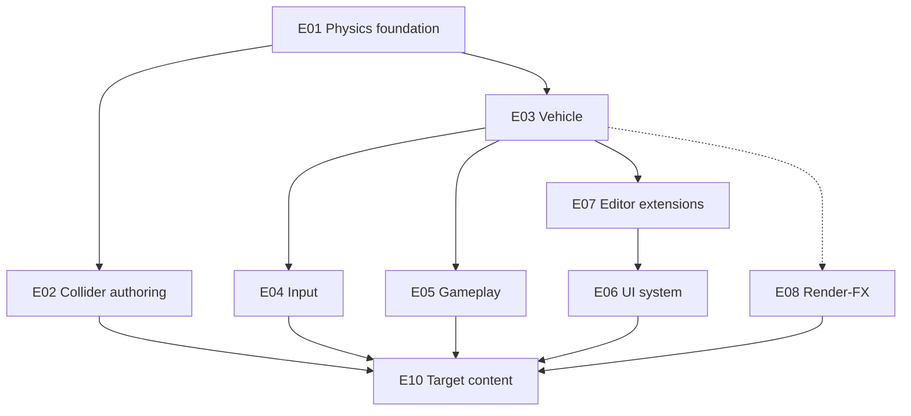

# Master Plan — raycast-vehicle

**Phase:** 1 · **Mode:** MASTER_PLAN · **Iteration:** 1  
**Platform branch:** `feat/reference-raycast-vehicle`  
**Target:** `~/work/tmp-js-game-project` (scaffolded — T01.37 ✅)  
**Reference:** `~/work/reference-raycast-vehicle` (read-only)

**Confirmed decisions:** [DECISIONS_LOG.md](./DECISIONS_LOG.md) (AD-01 … AD-08)

**Notion sync:** [NOTION_SYNC.md](../NOTION_SYNC.md) — git artifacts mirror 📎 Docs specs on board.

**Testing:** [TESTING_REQUIREMENTS.md](./TESTING_REQUIREMENTS.md) — mandatory on every T01.x spec.

---

## 1. Goal

Rebuild the **Raycast RC Car** reference as a @haku target project authored **through the editor**, extending the platform where the editor or engine lacks capability. Scope = **full clone** (AD-01): parity gameplay + in-game tuning panel; keyboard + mouse camera only for first shippable build (AD-07); post-FX deferred until driving feel works (AD-06).

---

## 2. Gap analysis — reference vs @haku

Legend: ✅ exists · 🟡 partial · ❌ missing

| # | Reference capability | @haku today | Gap | Epic |
| - | -------------------- | ----------- | --- | ---- |
| G1 | Physics world (fixed step) | ❌ | **Blocker** | E01 |
| G2 | Abstract swappable physics API | ❌ | **Blocker** (AD-02) | E01 |
| G3 | RaycastVehicle (4-wheel suspension) | ✅ | T01.12 | E03 |
| G4 | Static colliders (trimesh in ref) | ❌ | **Blocker** — platform A+B+C; project uses B | E01, E02 |
| G5 | Vehicle tunable params (~30) | ❌ | **Blocker** | E03, E07 |
| G6 | Keyboard drive + mouse camera | ❌ | **Blocker** (AD-07 v1) | E04 |
| G7 | Chase camera + orbit + airborne | 🟡 Camera component only | **High** | E05 |
| G8 | GLB level + car visuals | ✅ ModelGeometry, prefabs | Low | E10 |
| G9 | Lighting + shadows follow car | 🟡 ShadowSettings | Medium | E05 |
| G10 | Arcade assists (anti-wheelie, etc.) | ❌ | **High** | E03 |
| G11 | Boost / jump / respawn | ❌ | **High** | E03, E05 |
| G12 | Transporter rings | ❌ | Medium | E05 |
| G13 | Tire marks | ❌ | Medium | E03 |
| G14 | Speed HUD | ❌ | **High** (AD-04 UI system) | E06 |
| G15 | In-game tuning panel (lil-gui) | ❌ | **High** (AD-01) | E06 |
| G16 | Editor vehicle inspector + custom views | 🟡 generic inspector | **High** (AD-05) | E07 |
| G17 | Post-FX (grade, CA, wind, GTAO) | 🟡 bloom, vignette | Medium — **defer** (AD-06) | E08 |
| G18 | Agent editor automation (Playwright) | ❌ tooling | **Agent workflow** (AD-08) — not platform |
| G19 | ScriptRef runtime behaviors | 🟡 schema only | Medium — systems first | E05 |
| G20 | Target project scaffold | ✅ `~/work/tmp-js-game-project` | T01.37 done — unblocks T01.38+ | E10 |

---

## 3. Architectural decisions (confirmed)

| ID | Decision | Impact on plan |
| -- | -------- | -------------- |
| AD-01 | Full clone + in-game tuning panel | E06 T01.25; editor tuning in E07 |
| AD-02 | Abstract `@haku/physics`, Rapier first, no Rapier in core/schema | E01 foundation; all gameplay via interfaces |
| AD-03 | Platform A+B+C colliders; **this project = B (manual primitives)** | E02 focus; T01.5/T01.6 platform-only, not blocking M1 |
| AD-04 | Separate UI system (not scene entities) | E06 new package/module |
| AD-05 | Editor inspector + custom prefab/entity viewers | E07 before in-game panel |
| AD-06 | Post-FX final = reference match; **ship after driving feel** | E08 tasks after M1 |
| AD-07 | Input v1 = keyboard + mouse camera | E04 scope; mobile/gamepad post-M2 |
| AD-08 | Playwright = agent workflow tool (A–D flows); not platform epic | `.agents/tools/editor-playwright/`; see AGENT_EDITOR_WORKFLOW.md |

---

## 4. Milestones

### M1 — Drive on level (first playable)

**Exit criteria:** Target project open in editor; level with **manual primitive colliders**; vehicle prefab drives with WASD; chase camera + keyboard input; respawn on fall; shadows on. Scene assembled via **Playwright agent workflow** (not a platform deliverable).

| Includes | Tasks |
| -------- | ----- |
| Physics core + Rapier | T01.1–T01.4, T01.11–T01.14 |
| Collider authoring (mode B) | T01.7–T01.9 |
| Input v1 | T01.17–T01.18 |
| Camera + respawn | T01.19, T01.21 |
| Target scaffold + scene | T01.37–T01.39 (subagent uses Playwright per AD-08) |

**Explicitly deferred to M2:** assists polish, transporter, HUD, tuning panel, tire marks, post-FX.

### M2 — Full clone gameplay

**Exit criteria:** Reference parity mechanics (M1–M8 + P1–P7 from interpretation); in-game tuning panel; editor custom vehicle inspector; transporter; tire marks.

| Includes | Tasks |
| -------- | ----- |
| Assists + tire marks | T01.15–T01.16 |
| Gameplay polish | T01.20, T01.22 |
| UI system + HUD + tuning | T01.23–T01.25 |
| Editor custom views | T01.26–T01.27 |
| Content assembly | T01.40–T01.41 |

### M3 — Visual parity + automation complete

**Exit criteria:** Post-FX matches reference; optional GTAO; platform collider modes A+C available for future projects.

| Includes | Tasks |
| -------- | ----- |
| Post-FX stack | T01.28–T01.31 |
| Platform collider modes A+C | T01.5–T01.6 |
| Physics debug overlay | T01.10 |

---

## 5. Epic dependency graph

**Recommended execution order (orchestrator groom):**

1. **T01.37 → T01.38** (target scaffold + assets) — **before** any vehicle/platform task goes to Review with manual AC
2. E01 → E02 core (T01.1–T01.4, T01.7–T01.8) — unit tests only until target exists
3. E03 vehicle platform (T01.11–T01.14) + E04 input (T01.17–T01.18) — **Review gate:** target + smoke scene (T01.39) must exist for play-mode AC
4. **T01.39** M1 smoke scene — unblocks rework/Review of T01.11–T01.18
5. E05 camera/respawn (T01.19, T01.21) + E02 collider polish (T01.9)
6. E06 + E07 tuning UI (M2)
7. E10 M2 content (T01.40)
8. E08 post-FX (M3)
9. E01 A/C collider modes (M3)

---

## 6. Epics and tasks

### E01 — Physics foundation (`@haku/physics`)

| Task | Title | Type | Deps | Milestone |
| ---- | ----- | ---- | ---- | --------- |
| T01.1 | Create `@haku/physics` package — abstract API (world, bodies, shapes, raycast vehicle interface) | Feature | — | M1 |
| T01.2 | Rapier WASM backend adapter implementing abstract API | Feature | T01.1 | M1 |
| T01.3 | PhysicsWorldSystem — fixed timestep, engine integration, no Rapier types in `@haku/core` | Feature | T01.2 | M1 |
| T01.4 | Primitive colliders — box, sphere, capsule static/dynamic bodies ✅ | Feature | T01.3 | M1 |
| T01.5 | Auto trimesh collider from GLB mesh (mode A — platform) | Feature | T01.4 | M3 |
| T01.6 | Pre-baked collision mesh asset import (mode C — platform) | Feature | T01.4 | M3 |

**Acceptance (E01 core):** Playground or test harness steps physics world at 60 Hz; bodies sync to transforms; swap backend stub compiles without changing gameplay interfaces.

---

### E02 — Collider authoring

| Task | Title | Type | Deps | Milestone |
| ---- | ----- | ---- | ---- | --------- |
| T01.7 | Collider component schema + `@haku/core` registry ✅ | Feature | T01.4 | M1 |
| T01.8 | Serializer load/save collider components | Task | T01.7 | M1 |
| T01.9 | Editor — manual primitive collider authoring UI (mode B) ✅ | Feature | T01.8 | M1 |
| T01.10 | Physics debug wireframe + suspension ray overlay | Feature | T01.3, T01.9 | M3 |

**Acceptance:** Editor places box colliders on level entities; play mode collides with vehicle; **this project** uses manual ramps/boxes approximating `rc-level.glb` (AD-03).

**T01.9 delivery (editor):** `ColliderFields` inspector (box/sphere/capsule + static) via `commitSceneEdit`; `SceneColliderGizmos` green wireframe on selected entity; unit tests in `packages/editor/src/inspector/collider-section.test.tsx`; Playwright T01.9 against target `playground.scene.json`. Trimesh modes A/C (T01.5/6) and physics debug overlay (T01.10) out of scope.

---

### E03 — Vehicle component & system

| Task | Title | Type | Deps | Milestone |
| ---- | ----- | ---- | ---- | --------- |
| T01.11 | VehicleComponent schema — chassis, wheels, engine, suspension, assists params | Feature | T01.1 | M1 |
| T01.12 | RaycastVehicle on abstract physics layer (sketchbook-style, Rapier backend) | Feature | T01.2, T01.11 | M1 |
| T01.13 | VehicleControllerSystem — RWD, steer smooth, brake, boost, jump | Feature | T01.12 | M1 |
| T01.14 | Vehicle visual sync — body + 4 wheel GLBs from physics state | Feature | T01.13 | M1 |
| T01.15 | Arcade stability assists — anti-wheelie, upright, wall slide, landing grip, corner-lift | Feature | T01.13 | M2 |
| T01.16 | Tire mark streak system | Feature | T01.14 | M2 |

**Acceptance (M1):** Rear-wheel drive, steering, coast brake, boost cap, jump with grounded check; visuals match wheel contact points.

**T01.11 delivery (schema):** `@haku/schema` `VehicleSchema` with grouped chassis/wheels/suspension/engine/steering/brakes/jump/assists (~40 tunable fields); `@haku/core` `VehicleComponent` registry entry; schema defaults are **starting points for the Rapier stack** (tune in Play — not a 1:1 port of reference `DEFAULT_PARAMS`). Raycast sync (T01.12), controller (T01.13), editor inspector (T01.27) out of scope.

**T01.12 delivery (physics):** `stepRaycastVehicle` shared solver in `@haku/physics`; `WheelConfig` aligned with schema (`dampingRelaxation` / `dampingCompression`); stub + Rapier backends apply suspension/friction/engine forces; flat-ground integration tests (4 wheels, 120 steps). VehicleControllerSystem (T01.13), visual wheel sync (T01.14), arcade assists (T01.15) out of scope.

**T01.13 delivery (controller):** `VehicleControllerSystem` in `@haku/engine` (order 48) — RWD engine force, steer smoothing, coast/service/handbrake, boost cap, jump with grounded check; reads `VehicleComponent` params each frame; `setVehicleInput()` programmatic API. Unit + stub/Rapier integration tests. Input binding (T01.18), visual sync (T01.14), arcade assists (T01.15) out of scope.

---

### E04 — Runtime input

| Task | Title | Type | Deps | Milestone |
| ---- | ----- | ---- | ---- | --------- |
| T01.17 | Runtime input manager — keyboard + pointer (play mode) | Feature | — | M1 |
| T01.18 | Bind input actions to VehicleControllerSystem | Task | T01.13, T01.17 | M1 |

**Scope (AD-07):** WASD/arrows, Shift boost, Space jump/handbrake, R respawn, mouse orbit/zoom → camera. Touch/gamepad deferred.

**T01.18 delivery (input binding):** `InputBindingSystem` in `@haku/engine` (order 47) — each frame reads `InputManager.getActions()` → `VehicleControllerSystem.setVehicleInput()` for the controlled vehicle (explicit entity or first enabled `VehicleComponent`). Maps throttle/steer/brake/boost/jump; `onRespawn` callback for R pulse (stub until T01.21). `startVehiclePlayMode()` bootstrap wires controller + visual sync + input for playground and editor play mode. Unit + integration tests in `input-binding-system.test.ts`. Camera binding (T01.19) out of scope.

---

### E05 — Gameplay systems

| Task | Title | Type | Deps | Milestone |
| ---- | ----- | ---- | ---- | --------- |
| T01.19 | Chase camera system — follow, mouse orbit, airborne blend, boost FOV | Feature | T01.14, T01.18 | M1 |
| T01.20 | Shadow follow target — sun shadows track vehicle + texel snap | Feature | T01.14 | M2 |
| T01.21 | Respawn — fall threshold + manual reset | Task | T01.13 | M1 |
| T01.22 | Transporter trigger — two-way teleport between markers | Feature | T01.13 | M2 |

---

### E06 — UI system

| Task | Title | Type | Deps | Milestone |
| ---- | ----- | ---- | ---- | --------- |
| T01.23 | UI system foundation — DOM overlay, scene/component/script binding API (AD-04) | Feature | — | M2 |
| T01.24 | Speed HUD — km/h readout | Feature | T01.23, T01.13 | M2 |
| T01.25 | In-game tuning panel — lil-gui equivalent folders (Vehicle, Camera, World, Effects) | Feature | T01.23, T01.11 | M2 |

---

### E07 — Editor extensions

| Task | Title | Type | Deps | Milestone |
| ---- | ----- | ---- | ---- | --------- |
| T01.26 | Custom inspector panel registration API | Feature | — | M2 |
| T01.27 | Vehicle custom inspector + prefab viewer | Feature | T01.11, T01.26 | M2 |

---

### E08 — Render & post-FX (deferred per AD-06)

| Task | Title | Type | Deps | Milestone |
| ---- | ----- | ---- | ---- | --------- |
| T01.28 | Color grade + chromatic aberration shader passes | Feature | — | M3 |
| T01.29 | Wind streak boost effect pass | Feature | T01.28 | M3 |
| T01.30 | Optional GTAO pass (off by default) | Feature | T01.28 | M3 |
| T01.31 | Boost-linked post-FX + FOV blending | Task | T01.28, T01.19 | M3 |

---

### ~~E09 — Playwright editor automation~~ — **CANCELLED**

> **Superseded by AD-08 (2026-07-11):** Playwright is agent workflow tooling, not platform work.  
> See [`AGENT_EDITOR_WORKFLOW.md`](../AGENT_EDITOR_WORKFLOW.md).  
> Notion tasks T01.32–T01.36 and epic E09 are **out of scope** for the board.

| Task | Status |
| ---- | ------ |
| ~~T01.32~~ | Cancelled — agent bootstrap |
| ~~T01.33–T01.36~~ | Cancelled — flows live in agent workflow doc |

---

### E10 — Target content

| Task | Title | Type | Deps | Milestone |
| ---- | ----- | ---- | ---- | --------- |
| T01.37 | Scaffold target via `@haku/create` → `~/work/tmp-js-game-project` | Task | — | M1 |
| T01.38 | Import reference GLBs + reflection env into target assets | Task | T01.37 | M1 |
| T01.39 | **M1 scene** — level mesh, manual colliders, lights, camera, vehicle prefab spawn (**via Playwright agent workflow**). **Iteration 2:** chase cam orbit + respawn + shadow follow; Playwright tier B/C extended. | Task | T01.9, T01.14, T01.19, T01.38 | M1 |
| T01.40 | **M2 scene** — transporter markers, HUD wiring, tuning panel hooks | Task | T01.22, T01.24, T01.25, T01.39 | M2 |
| T01.41 | **M3 scene** — post-FX profile match reference demo | Task | T01.28, T01.40 | M3 |

---

## 7. Task index (ordered for grooming)

**36 active tasks** (T01.32–T01.36 cancelled — agent workflow only).

| Order | Task | Epic | Milestone |
| ----- | ---- | ---- | --------- |
| 1 | T01.37 | E10 | M1 |
| 2 | T01.38 | E10 | M1 |
| 3 | T01.1 | E01 | M1 |
| 4 | T01.2 | E01 | M1 |
| 5 | T01.3 | E01 | M1 |
| 6 | T01.4 | E01 | M1 |
| 7 | T01.7 | E02 | M1 |
| 8 | T01.8 | E02 | M1 |
| 9 | T01.11 | E03 | M1 |
| 10 | T01.12 | E03 | M1 |
| 11 | T01.13 | E03 | M1 |
| 12 | T01.14 | E03 | M1 |
| 13 | T01.17 | E04 | M1 |
| 14 | T01.18 | E04 | M1 |
| 15 | T01.39 | E10 | M1 |
| 16 | T01.19 | E05 | M1 |
| 17 | T01.21 | E05 | M1 |
| 18 | T01.9 | E02 | M1 |
| 19 | T01.26 | E07 | M2 |
| 20 | T01.15 | E03 | M2 |
| 21 | T01.16 | E03 | M2 |
| 22 | T01.20 | E05 | M2 |
| 23 | T01.22 | E05 | M2 |
| 24 | T01.23 | E06 | M2 |
| 25 | T01.27 | E07 | M2 |
| 26 | T01.24 | E06 | M2 |
| 27 | T01.25 | E06 | M2 |
| 28 | T01.40 | E10 | M2 |
| 29 | T01.28 | E08 | M3 |
| 30 | T01.29 | E08 | M3 |
| 31 | T01.30 | E08 | M3 |
| 32 | T01.31 | E08 | M3 |
| 33 | T01.5 | E01 | M3 |
| 34 | T01.6 | E01 | M3 |
| 35 | T01.10 | E02 | M3 |
| 36 | T01.41 | E10 | M3 |

---

## 8. Risks and mitigations

| Risk | Mitigation |
| ---- | ---------- |
| Rapier has no built-in raycast vehicle API | Custom sketchbook-style solver on abstract layer (AD-02); delivered in T01.12 |
| Manual colliders ≠ reference trimesh fidelity | AD-03 accepted; approximate ramps with boxes; A/C for other projects |
| ~20 MB GLB assets | Import as-is for demo; optimize in T01.38 if load times block CI |
| ScriptRef immaturity | Vehicle logic in engine systems first; ScriptRef for transporter later if needed |
| Agent Playwright flakiness | Document selectors in AGENT_EDITOR_WORKFLOW.md; fallback to scene JSON with comment |

---

## 9. Out of scope (this cycle)

- Mobile / touch / gamepad input (post AD-07 v1)
- Multiplayer, audio, save/load
- Third-party physics engine ports or Rapier types in components
- Moving Notion tasks to **To do** (orchestrator)
- Production code in this Phase 1 task

---

## 10. References

- [REFERENCE_INVENTORY.md](./REFERENCE_INVENTORY.md)
- [REFERENCE_INTERPRETATION.md](./REFERENCE_INTERPRETATION.md)
- [DECISIONS_LOG.md](./DECISIONS_LOG.md)
- [AGENT_EDITOR_WORKFLOW.md](../AGENT_EDITOR_WORKFLOW.md)
- [docs/reference-driven-cycle.md](../../reference-driven-cycle.md)
- [docs/architecture.md](../../architecture.md)
